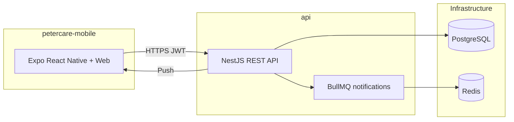

# Peter Care

Coordinate feeding shifts, rides, treatments, and barn tasks — so your stable team stays in sync.

**Platforms:** iOS · Android · Web · **Requires:** Node.js 20+

---

## About

Peter Care is a horse stable coordination app built for barn teams. Owners, caregivers, and guests share one schedule for daily operations — who feeds in the morning, who rides which horse, what treatments are due, and which barn tasks still need doing.

The app is organized around four main areas:

- **My Schedule** — your personal day and week at a glance: feedings, rides, treatments, and tasks assigned to you
- **Stable Planner** — the shared calendar where the team plans feedings, rides, treatments, and barn tasks together
- **The Barn** — the horse directory, profiles, and treatment history
- **Reports** — weekly insights and activity stats across the stable

Access is role-based (**Owner**, **Caregiver**, **Guest**), with an owner dashboard for approving caregiver requests and managing staff. Push and email notifications keep everyone informed about unassigned shifts, incomplete feedings, and upcoming deadlines.

---

## Features

- **Feeding shifts** — morning and evening shifts with volunteer and take-over flows
- **Rides** — schedule rides with primary and additional riders; join rides as a guest rider
- **Treatments & tasks** — track horse treatments and barn tasks with assignees and due dates
- **Horse profiles** — names, colors, shoeing dates, and treatment history in one place
- **Team coordination** — caregiver role requests, owner approval, and color-coded assignees on the calendar
- **Notifications** — scheduled alerts for unassigned feedings and task deadlines, delivered via Expo push (native) and Firebase (web)
- **Authentication** — sign up, JWT login, and password reset via email OTP
- **Multi-platform** — one Expo codebase for iOS, Android, and web

---

## Architecture



In production, the API runs on [Render](https://petercare.onrender.com), the web client is deployed via Vercel (Expo static export), and native builds use EAS. PostgreSQL is hosted on Supabase; locally, Docker provides Postgres and Redis.

---

## Repository structure

```
PeterCare/
├── api/                 # NestJS backend (REST, auth, notifications)
├── petercare-mobile/    # Expo app (iOS, Android, web)
├── docker-compose.yml   # Local Postgres + Redis
├── DEV.md               # Local development guide
└── .env.example         # Backend environment template
```

---

## Tech stack

| Layer | Stack |
|-------|-------|
| Backend | NestJS 11, TypeORM, PostgreSQL, Redis, BullMQ, JWT, Firebase Admin |
| Client | Expo ~54, React Native, React Navigation, Axios, Luxon |
| Local infra | Docker Compose (Postgres 15, Redis 7) |

---

## Getting started

1. **Prerequisites** — [Docker Desktop](https://www.docker.com/products/docker-desktop/), Node.js 20+, and [Expo Go](https://expo.dev/go) on your phone (for device testing on the same Wi‑Fi network)

2. **Environment** — copy the env templates and install dependencies:

   ```powershell
   copy .env.example .env
   copy petercare-mobile\.env.example petercare-mobile\.env
   cd api && npm install
   cd ..\petercare-mobile && npm install
   ```

3. **Run locally** — from the repo root:

   ```powershell
   npm run infra:up
   npm run db:migrate
   npm run dev:api      # Terminal 1
   npm run dev:mobile   # Terminal 2
   ```

> **Full setup, troubleshooting, and production notes:** see [DEV.md](DEV.md).

---

## Available scripts

Run these from the repo root:

| Command | Description |
|---------|-------------|
| `npm run infra:up` | Start Postgres + Redis containers |
| `npm run infra:down` | Stop containers |
| `npm run dev:api` | Start NestJS with hot reload |
| `npm run dev:mobile` | Start Expo dev server (prints LAN IP) |
| `npm run db:migrate` | Run TypeORM migrations on local Postgres |

---

## License

This project is private and **UNLICENSED**. The MIT file under `petercare-mobile/LICENSE` is the Expo template license, not a project-wide license.
